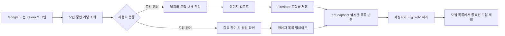

# Running Crew - 함께 달릴 사람을 모집하는 러닝 커뮤니티

<div align="center">
  
</div>

- 배포 URL: [https://running-crew.netlify.app/](https://running-crew.netlify.app/)
- 포트폴리오: [Running Crew 프로젝트 소개](https://sonminseock.github.io/developer-portfolio/#/projects/running-crew)

## 목차

- [프로젝트 소개](#프로젝트-소개)
- [프로젝트 배경](#프로젝트-배경)
- [프로젝트 기간 및 구성](#프로젝트-기간-및-구성)
- [개발 환경](#개발-환경)
- [서비스 흐름](#서비스-흐름)
- [채택한 개발 기술](#채택한-개발-기술)
- [주요 기능](#주요-기능)
- [핵심 코드 바로가기](#핵심-코드-바로가기)
- [기술적 고민과 해결](#기술적-고민과-해결)
- [로컬 실행 방법](#로컬-실행-방법)

## 프로젝트 소개

Running Crew는 사용자가 원하는 날짜의 러닝 모임을 만들고, 함께 달릴 크루를 모집하거나 참여할 수 있는 모바일 중심의 커뮤니티 서비스입니다.

- 러닝 일정과 모집 내용을 게시하고 이미지를 첨부할 수 있습니다.
- 모집 중인 러닝을 실시간으로 확인하고 최대 5명까지 참여할 수 있습니다.
- Google 또는 Kakao 계정으로 로그인하고 자신의 모집글과 프로필을 관리할 수 있습니다.

## 프로젝트 배경

혼자 운동하면 러닝을 꾸준히 지속하기 어렵고, 일정에 맞춰 함께 달릴 사람을 찾거나 참여자를 관리하기도 어렵습니다.

이 문제를 해결하기 위해 러닝 일정 등록부터 참여자 모집, 참여 현황 확인까지 하나의 흐름으로 제공하는 서비스를 개발했습니다. 별도의 백엔드 서버를 구축하는 대신 Firebase의 인증, 데이터베이스, 스토리지를 활용해 개인 프로젝트에서도 핵심 기능을 빠르게 검증할 수 있도록 구성했습니다.

## 프로젝트 기간 및 구성

- 개발 기간: 2024.12
- 개발 인원: 프론트엔드 1명
- 담당 범위: 기획, UI 구현, 프론트엔드 개발, Firebase 연동, 배포

## 개발 환경

### Frontend

<div>
  
  
  
  
  
</div>

### Backend as a Service

<div>
  
  
  
  
</div>

### Library & Deploy

<div>
  
  
  
  
</div>

## 서비스 흐름



## 채택한 개발 기술

### React + TypeScript

- 페이지와 폼, 레이아웃을 컴포넌트 단위로 분리해 생성과 수정 화면의 UI를 재사용했습니다.
- 사용자와 게시글 데이터 구조를 타입으로 정의해 Firebase 응답과 전역 상태를 일관된 형태로 관리했습니다.

### Redux Toolkit

- 로그인 사용자와 선택한 모집글을 전역 상태로 관리했습니다.
- 목록에서 상세 화면으로 이동할 때 선택한 게시글을 저장하고, 참여 또는 러닝 시작 직후 UI에 변경 결과를 반영했습니다.

### Firebase

- Firebase Authentication의 Google 로그인과 Kakao JavaScript SDK 로그인을 하나의 사용자 상태 구조로 통합했습니다.
- Firestore의 `onSnapshot`을 사용해 새 모집글과 상태 변경을 홈 화면에 실시간 반영했습니다.
- Firebase Storage에 `posts/{userId}/{postId}` 경로로 이미지를 저장하고 다운로드 URL을 게시글 문서에 연결했습니다.

### styled-components

- 모바일 서비스에 맞춰 최대 너비를 `480px`로 제한하고 하단 고정 내비게이션을 구현했습니다.
- 컴포넌트의 상태와 현재 경로에 따라 업로드 영역, 버튼, 내비게이션 스타일을 변경했습니다.

## 주요 기능

### Google · Kakao 소셜 로그인

- Google 로그인은 Firebase Authentication의 팝업 인증을 사용합니다.
- Kakao 로그인은 Kakao SDK에서 사용자 정보를 조회하고, 신규 사용자는 Firestore `users` 컬렉션에 저장합니다.
- 공급자가 다른 사용자 데이터도 `userId`, `userName`, `photoUrl`, `provider` 구조로 통일해 Redux에서 관리합니다.
- 인증이 필요한 페이지는 `ProtectedRoute`를 통해 로그인 화면으로 이동시킵니다.

### 러닝 크루 모집글 생성 및 수정

- 제목, 모집 내용, 러닝 날짜를 입력해 모집글을 생성합니다.
- 클릭과 드래그 앤 드롭 방식의 단일 이미지 업로드와 업로드 전 미리보기를 제공합니다.
- 과거 날짜는 선택할 수 없으며, 비동기 저장 중에는 로딩 UI를 표시합니다.
- 수정 시 변경된 필드만 Firestore에 반영하고 이미지가 교체되면 Storage의 기존 파일을 변경합니다.

### 모집글 실시간 조회

- 최근 모집글을 생성일 역순으로 최대 25개 조회합니다.
- Firestore `onSnapshot` 구독을 통해 생성 및 변경 사항을 별도의 새로고침 없이 반영합니다.
- 컴포넌트가 언마운트될 때 구독을 해제해 불필요한 리스너가 남지 않도록 처리했습니다.

### 크루 참여 및 모집 마감

- 로그인한 사용자는 모집 중인 러닝에 참여할 수 있습니다.
- 참여자 ID를 확인해 중복 참여를 방지하고 최대 참여 인원을 5명으로 제한했습니다.
- 작성자는 러닝 시작 상태로 변경할 수 있으며, 시작된 러닝은 홈의 모집 목록에서 제외됩니다.

### 프로필 및 활동 관리

- 사용자는 자신의 프로필과 작성한 러닝 모집글을 확인할 수 있습니다.
- 이름 변경 시 인증 공급자의 사용자 정보뿐 아니라 기존 게시글에 중복 저장된 작성자 이름도 함께 변경합니다.
- 여러 게시글의 작성자 이름은 Firestore Write Batch로 한 번에 반영해 데이터 일관성을 유지합니다.

## 핵심 코드 바로가기

아래 링크는 실제 사용자가 서비스를 이용하는 흐름 순서로 정리했습니다.

### 1. 로그인 및 접근 제어

- [Kakao 기존 사용자 조회 및 신규 사용자 저장](https://github.com/SonMinSeock/running-crew/blob/master/src/pages/Login/index.tsx#L125-L188)<br />
  Kakao 사용자 ID로 Firestore 문서를 조회하고, 신규 사용자만 `users` 컬렉션에 저장합니다.
- [Google 팝업 로그인과 공통 사용자 상태 변환](https://github.com/SonMinSeock/running-crew/blob/master/src/pages/Login/index.tsx#L190-L210)<br />
  Firebase 사용자 정보를 애플리케이션의 `UserState` 구조로 변환해 Redux에 저장합니다.
- [인증 페이지 접근 제어](https://github.com/SonMinSeock/running-crew/blob/master/src/components/ProtectedRoute.tsx#L5-L12)<br />
  로그인 정보가 없으면 모집글 생성, 수정, 프로필 페이지 대신 로그인 화면을 렌더링합니다.

### 2. 러닝 모집글 생성

- [드래그 앤 드롭 이미지 선택 및 단일 파일 제한](https://github.com/SonMinSeock/running-crew/blob/master/src/pages/PostCreate/index.tsx#L43-L83)<br />
  클릭과 드롭 입력을 하나의 파일 상태로 관리하고 여러 파일이 들어오는 경우 업로드를 막습니다.
- [모집글 생성과 Firebase Storage 이미지 업로드](https://github.com/SonMinSeock/running-crew/blob/master/src/pages/PostCreate/index.tsx#L85-L138)<br />
  Firestore 문서를 먼저 생성해 게시글 ID를 확보한 뒤, 해당 ID를 Storage 경로로 사용해 이미지를 연결합니다.
- [러닝 날짜 선택과 과거 날짜 제한](https://github.com/SonMinSeock/running-crew/blob/master/src/pages/PostCreate/index.tsx#L148-L191)<br />
  `react-calendar`의 `minDate`를 현재 날짜로 설정해 과거 일정을 등록하지 못하게 합니다.

### 3. 실시간 모집글 조회

- [Firestore 실시간 구독과 Redux 목록 동기화](https://github.com/SonMinSeock/running-crew/blob/master/src/pages/Home/index.tsx#L117-L151)<br />
  최근 25개 모집글을 `onSnapshot`으로 구독하고 Redux 게시글 목록을 갱신합니다.
- [모집 중인 러닝만 홈 화면에 렌더링](https://github.com/SonMinSeock/running-crew/blob/master/src/pages/Home/index.tsx#L214-L248)<br />
  `isRunning`이 `false`인 게시글만 노출해 종료된 모집을 목록에서 제외합니다.

### 4. 크루 참여

- [로그인, 정원, 중복 참여 검증과 참여자 업데이트](https://github.com/SonMinSeock/running-crew/blob/master/src/pages/PostDetail/index.tsx#L142-L177)<br />
  참여 전에 로그인 여부와 5명 정원, 동일 사용자 참여 여부를 검사한 뒤 Firestore와 Redux를 갱신합니다.
- [참여 인원에 따른 버튼 상태와 참여자 프로필 표시](https://github.com/SonMinSeock/running-crew/blob/master/src/pages/PostDetail/index.tsx#L194-L223)<br />
  정원이 차면 참여 버튼을 비활성화하고 현재 참여자의 프로필을 가로 목록으로 제공합니다.

### 5. 러닝 시작 및 모집 종료

- [작성자의 러닝 시작 처리](https://github.com/SonMinSeock/running-crew/blob/master/src/pages/PostDetail/index.tsx#L106-L140)<br />
  작성자만 실행 버튼을 볼 수 있으며 `isRunning` 값을 변경해 모집 상태를 종료합니다.

### 6. 프로필 데이터 일관성 유지

- [Write Batch를 이용한 기존 게시글 작성자 이름 일괄 변경](https://github.com/SonMinSeock/running-crew/blob/master/src/pages/ProfileUpdate/index.tsx#L70-L124)<br />
  사용자 이름이 변경되면 해당 사용자의 게시글을 조회하고 모든 `username` 필드를 하나의 Batch로 업데이트합니다.

```text
소셜 로그인 → 모집글 실시간 조회 → 모집글 생성 및 이미지 업로드
→ 참여 정원·중복 검증 → 참여자 목록 갱신 → 작성자의 러닝 시작 처리
```

## 기술적 고민과 해결

### Firestore 비정규화 데이터의 일관성

#### 문제

모집글 목록에서 작성자 이름을 별도 조회 없이 표시하기 위해 게시글 문서에도 `username`을 저장했습니다. 이 구조는 읽기에는 효율적이지만, 사용자가 이름을 변경하면 사용자 정보와 기존 게시글의 작성자 이름이 달라질 수 있습니다.

#### 해결

1. 사용자 ID로 작성한 게시글을 모두 조회합니다.
2. 각 게시글의 `username` 변경 작업을 Write Batch에 추가합니다.
3. `batch.commit()`으로 변경 사항을 한 번에 반영합니다.
4. 인증 공급자의 프로필과 Redux 사용자 상태도 같은 이름으로 갱신합니다.

이를 통해 여러 문서를 순차적으로 수정할 때 발생할 수 있는 중간 실패와 데이터 불일치 가능성을 줄였습니다.

### 실시간 데이터와 화면 상태 동기화

#### 문제

게시글 생성이나 다른 사용자의 참여 이후 매번 목록을 다시 요청하면 화면 갱신 코드가 복잡해지고 최신 상태를 놓칠 수 있습니다.

#### 해결

Firestore `onSnapshot`으로 게시글 목록을 구독하고 수신한 데이터를 Redux에 저장했습니다. 상세 화면에서는 참여 직후 선택된 게시글 상태도 함께 갱신해 서버 반영을 기다리는 동안에도 사용자에게 최신 참여 결과를 보여주도록 구성했습니다.

## 로컬 실행 방법

### 1. 저장소 설치

```bash
git clone https://github.com/SonMinSeock/running-crew.git
cd running-crew
npm install
```

### 2. 환경 변수 설정

프로젝트 루트에 `.env` 파일을 생성하고 Firebase 및 Kakao 애플리케이션 값을 입력합니다.

```env
VITE_APP_API_KEY=
VITE_APP_AUTHDOMAIN=
VITE_APP_PROJECT_ID=
VITE_APP_STORAGE_BUCKET=
VITE_APP_MESSAGING_SENDER_ID=
VITE_APP_MEASUREMENT_ID=
VITE_APP_APP_ID=
VITE_APP_KAKAO_APP_KEY=
```

### 3. 개발 서버 실행

```bash
npm run dev
```

### 4. 빌드

```bash
npm run build
```
